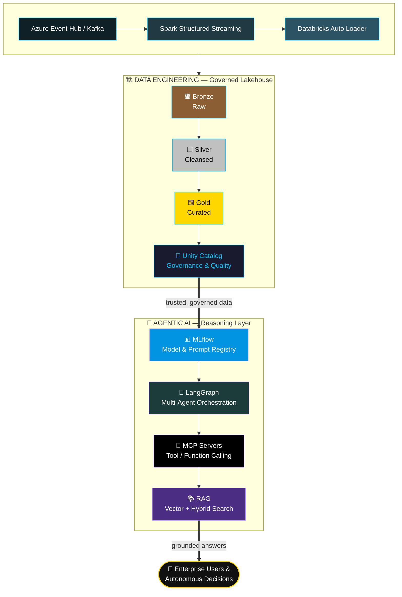

 

  
  
  

<table>
<tr>
<td align="center"></td>
<td align="center">✕</td>
<td align="center"></td>
<td align="center">=</td>
<td align="center"></td>
</tr>
</table>

 

## 🧭 Value Proposition

> I design **enterprise-scale data platforms** and fuse them with **Agentic AI** to build autonomous, intelligent, production-ready systems — where pipelines don't just move data, they reason over it.

My work sits on three pillars:

| 🏗️ Data Engineering | ☁️ Cloud Data Platform | 🤖 Agentic AI Engineering |
|---|---|---|
| Spark, PySpark, Databricks, Delta Lake, Unity Catalog, Auto Loader, DLT, dbt, Airflow, Kafka, Structured Streaming | Medallion Architecture, real-time streaming, batch ETL, data governance & quality, CI/CD, Docker, GitHub Actions, IaC | LangGraph, LangChain, LangSmith, MCP servers, tool/function calling, multi-agent systems, RAG, MLflow, Databricks AI Apps |

## ⚡ The Convergence — Where Two Disciplines Become One

```mermaid
flowchart LR
    subgraph DE["🏗️ DATA ENGINEER"]
        direction TB
        D1(("Azure &<br/>Databricks"))
        D2(("Spark &<br/>Delta Lake"))
        D3(("Streaming &<br/>Governance"))
        D1 --- D2 --- D3
    end

    subgraph CORE["✨ AGENTIC AI DATA ENGINEER"]
        direction TB
        X((("🧬<br/>Autonomous<br/>Intelligent<br/>Platforms")))
    end

    subgraph AI["🤖 AGENTIC AI ENGINEER"]
        direction TB
        A1(("LangGraph &<br/>MCP"))
        A2(("RAG &<br/>Vector Search"))
        A3(("MLflow &<br/>Observability"))
        A1 --- A2 --- A3
    end

    DE ==>|"reliable, governed data"| CORE
    AI ==>|"reasoning & autonomy"| CORE
    CORE ==>|"ships production systems"| OUT(["🚀 Enterprise Impact"])

    classDef de fill:#0F2027,color:#00C6FF,stroke:#00C6FF,stroke-width:2px;
    classDef ai fill:#1a0f2e,color:#B084FF,stroke:#B084FF,stroke-width:2px;
    classDef core fill:#101820,color:#FFD700,stroke:#FFD700,stroke-width:3px;
    classDef out fill:#111,color:#fff,stroke:#00C6FF,stroke-width:2px;

    class D1,D2,D3 de
    class A1,A2,A3 ai
    class X core
    class OUT out
```

Two disciplines. One engineer. Data pipelines that don't just move data — they <b>reason</b> over it, <b>act</b> on it, and <b>govern</b> it.

## 🏛️ Reference Architecture — Lakehouse ⇄ Agent Layer

## 🤖 Agentic AI Showcase

<table>
<tr>
<td width="50%" valign="top">

### 🧠 Autonomous Data Agents
- Intelligent workflow orchestration
- Multi-agent collaboration
- Dynamic planning & task decomposition
- Memory-enabled reasoning
- Human-in-the-loop checkpoints

</td>
<td width="50%" valign="top">

### 📚 Enterprise RAG Systems
- Hybrid search (keyword + semantic)
- Vector search & embeddings
- Context engineering
- Grounded, citation-backed responses
- Automated AI evaluation

</td>
</tr>
<tr>
<td width="50%" valign="top">

### 🔧 AI Tool Integration
- MCP servers
- SQL & Databricks API tool calling
- REST APIs & Azure services
- Python-native tool ecosystems
- External knowledge sources

</td>
<td width="50%" valign="top">

### 📊 LLMOps
- MLflow experiment & model tracking
- LangSmith tracing
- Prompt versioning
- Evaluation pipelines
- AI observability & monitoring

</td>
</tr>
</table>

## 🛠️ Skills Dashboard

**☁️ Cloud**

**🏗️ Data Engineering**

**🌊 Streaming**

**🤖 AI Engineering**

**⚙️ DevOps**

## 📌 Featured Projects

<table>
<tr>
<td width="50%">

### 🏞️ Intelligent Lakehouse Platform
**Azure · Spark · Databricks · Delta · Unity Catalog**
Medallion-architecture Lakehouse with governed Bronze/Silver/Gold layers and CI/CD via Azure DevOps.
📎 [`Azure-Data-Pipeline-Medallion-DevOps`](https://github.com/Tahafurkhan/Azure-Data-Pipeline-Medallion-DevOps)

</td>
<td width="50%">

### 🌊 Enterprise Streaming Pipeline
**Kafka · Event Hub · Structured Streaming · Delta Lake**
Real-time vehicle tracking & monitoring pipeline on Azure with low-latency stream processing.
📎 [`traccia-azure-streaming-pipeline`](https://github.com/Tahafurkhan/traccia-azure-streaming-pipeline)

</td>
</tr>
<tr>
<td width="50%">

### 🕵️ FinGuard — Real-Time Fraud Detection
**Databricks · Spark Structured Streaming · Kafka · Delta Lake**
Watermarked stream-stream joins detecting fraud in real time across a Bronze→Silver→Gold Lakehouse.
📎 [`fingurad_fraudetection_streaming_project`](https://github.com/Tahafurkhan/fingurad_fraudetection_streaming_project)

</td>
<td width="50%">

### 🤖 Agentic AI Data Assistant
**LangGraph · MCP · MLflow · Tool Calling · RAG**
Autonomous agent layer that reasons over Lakehouse data, calls tools, and grounds answers via RAG.
📎 *In progress — check pinned repos*

</td>
</tr>
</table>

## 📊 GitHub Dashboard

  
  

  

  

  

<!--
Optional: contribution snake animation.
Requires a one-time GitHub Actions workflow in this repo
(platane/snk) that runs on a schedule and commits the generated
SVG below — cannot be generated from a README edit alone.

  

-->

*Building the future of enterprise data platforms — where Data Engineering meets Agentic AI.*

